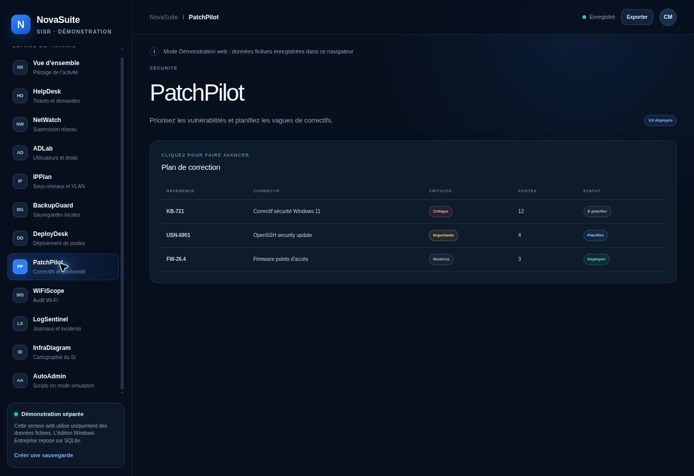

# NovaSuite SISR 3.0

NovaSuite réunit onze outils d’administration SISR dans une seule application : HelpDesk, NetWatch, ADLab, IPPlan, BackupGuard, DeployDesk, PatchPilot, WiFiScope, LogSentinel, InfraDiagram et AutoAdmin.

Le projet propose deux éditions strictement séparées :

- **NovaSuite Entreprise pour Windows** : application installable, hors connexion et équipée d’une base locale SQLite ;
- **[NovaSuite Démonstration web](https://novasuite-sisr.malivert-christian.chatgpt.site)** : vitrine interactive avec données fictives stockées dans le navigateur.

## Captures d’écran




## Fonctionnalités professionnelles

- base SQLite unifiée pour les utilisateurs, équipements, tickets et incidents ;
- connexion sécurisée avec rôles `administrateur`, `technicien` et `lecteur` ;
- mots de passe dérivés avec `scrypt` et champs sensibles chiffrés en AES-256-GCM ;
- clé principale protégée par le coffre-fort du système Windows via Electron `safeStorage` ;
- historique d’audit des créations, modifications, suppressions, connexions et exports ;
- sauvegardes automatiques configurables, rotation et restauration avec copie de sécurité ;
- rapports professionnels PDF et CSV générés sans service externe ;
- notifications locales pour pannes, sauvegardes échouées et correctifs critiques ;
- tableau de bord personnalisable avec statistiques et graphiques ;
- modes Démonstration et Entreprise dans deux bases différentes ;
- imports CSV d’utilisateurs Active Directory et d’équipements ;
- verrouillage automatique de la session ;
- assistant de première installation et installateur Windows NSIS.

## Démarrer l’édition Windows

Prérequis pour le développement : Node.js 24 et Windows 10/11 64 bits.

```powershell
cd desktop
npm ci
npm start
```

Construire l’installateur :

```powershell
cd desktop
npm run dist:windows
```

Le workflow GitHub Actions `Build Windows installer` construit également `NovaSuite-SISR-Setup-3.0.0.exe` sur une machine Windows et le publie comme artefact.

## Première utilisation

1. Installer NovaSuite avec l’assistant Windows.
2. Créer le premier compte administrateur.
3. Choisir les délais de sauvegarde et de verrouillage.
4. Importer les utilisateurs et équipements, ou commencer par le mode Démonstration.
5. Créer immédiatement une première sauvegarde.

Le mode Démonstration utilise uniquement des données fictives. Son compte local est `demo.admin` avec le mot de passe `NovaSuite!2026`.

## Tests

```bash
node --test tests/desktop-*.test.mjs
npm run lint
npm run build
npm test
```

Les tests vérifient notamment SQLite, les relations entre modules, le chiffrement, les mots de passe, les imports CSV, les statistiques et la séparation des deux modes.

## Documentation

- [Guide d’installation Windows](docs/INSTALLATION_WINDOWS.md)
- [Guide utilisateur](docs/GUIDE_UTILISATEUR.md)
- [Architecture technique](docs/ARCHITECTURE.md)
- [Sécurité et sauvegardes](docs/SECURITE.md)
- [Données d’import fictives](samples)

## Limites connues

- l’édition Entreprise est conçue pour un poste Windows local et un utilisateur connecté à la fois ;
- une sauvegarde contenant des champs chiffrés doit être restaurée avec le même profil Windows et la même clé locale ;
- les imports Active Directory passent par un export CSV contrôlé : NovaSuite n’exécute aucune commande AD distante ;
- AutoAdmin reste en mode Dry-Run et ne lance aucune commande système réelle ;
- l’installateur n’est pas signé numériquement tant qu’un certificat de signature de code n’est pas configuré.

## Licence

Projet de portfolio BTS SIO SISR de Christian Malivert, publié sous licence MIT.
