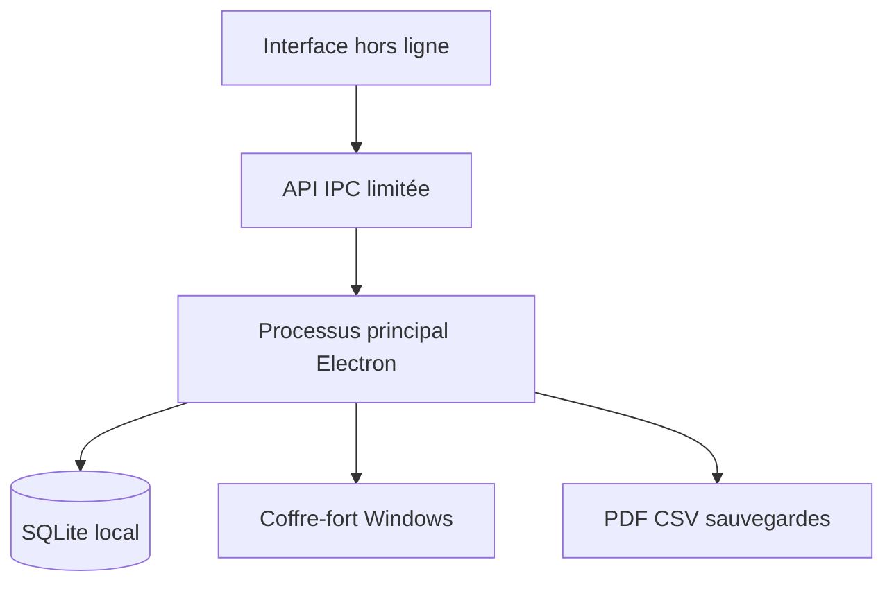

# Architecture technique

NovaSuite Entreprise est une application Electron locale. Le processus principal est le seul à accéder au système de fichiers, à SQLite, aux notifications et à la génération PDF.

Le rendu HTML/CSS/JavaScript n’a pas accès à Node.js. Une API minimale est exposée par `preload.cjs` avec `contextIsolation`, `sandbox` et `nodeIntegration: false`.

## Base unifiée

Les tables `directory_users`, `equipment`, `tickets` et `incidents` sont les référentiels communs. DeployDesk, PatchPilot, LogSentinel et InfraDiagram réutilisent leurs identifiants au lieu de recopier les données.

Le journal `audit_logs` conserve l’auteur, l’action, le type d’objet, son identifiant, l’état avant et l’état après.

## Séparation des modes

- `novasuite-entreprise.sqlite` contient les données professionnelles ;
- `novasuite-demonstration.sqlite` contient les données fictives ;
- une session est toujours rattachée à un seul mode ;
- les API refusent une restauration du mode Démonstration vers Entreprise.

Electron Builder produit un assistant NSIS non silencieux. Le workflow GitHub Actions utilise `windows-latest` pour générer un véritable exécutable Windows.
